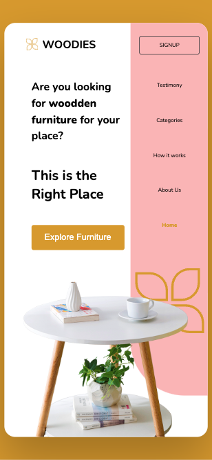

# WOODIES (Backend: server in Localhost)

The server is capable of handling SVG, PNG, fonts, and navigation across all pages. However, styles have not been finalized for all pages. Not yet deployed.

# Server 9898 works

# Mobile

